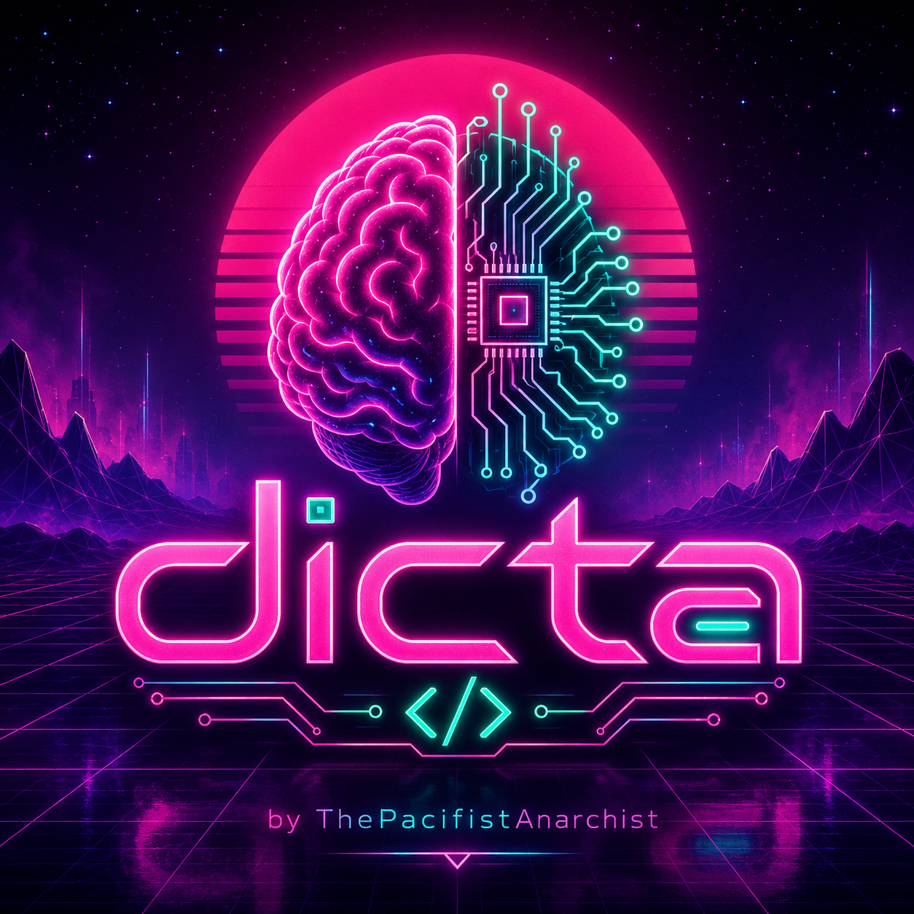

<p align="center">
  
</p>

# Dicta

Dicta is a hosted Python 3.13/Pydantic prototype for a future general-purpose
programming language.

This repository currently contains only the semantic kernel scaffold. It models
the first representation chain:

Datum -> Dictum -> Qualification -> Concept -> Purpose -> Disparity -> Inference
-> Outcome -> Revision -> Program

## Current scope

- Pydantic contracts for the first semantic terms.
- A small program-motion helper layer.
- Hard-coded Typer CLI demos for arithmetic success/refusal, counter revision,
  file-write effects, supervised worker failure, and AI-agent edit appraisal.
- Tests proving the current model layer, query helpers, and demo
  representations.

## Docs

- [Foundation design record](docs/design_record_000_foundation.md)
- [Revision projection design record](docs/design_record_001_revision_projection.md)
- [Semantic test matrix](docs/semantic_test_matrix_000.md)

## Not in scope yet

- Parser
- Syntax
- Compiler
- VM
- Lowering
- Self-hosting
- Optimization

## Setup with uv

```powershell
uv venv .env --python 3.13
.env\Scripts\Activate.ps1
uv sync
```

## Setup without uv

```powershell
py -3.13 -m venv .env
.env\Scripts\Activate.ps1
python -m pip install -e .
python -m pip install pytest ruff
```

## Run checks

```powershell
pytest
ruff check .
```

## Run the demo

```powershell
dicta demo
```

The demos are hard-coded semantic fixtures. They do not parse source text.
